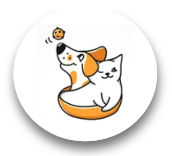
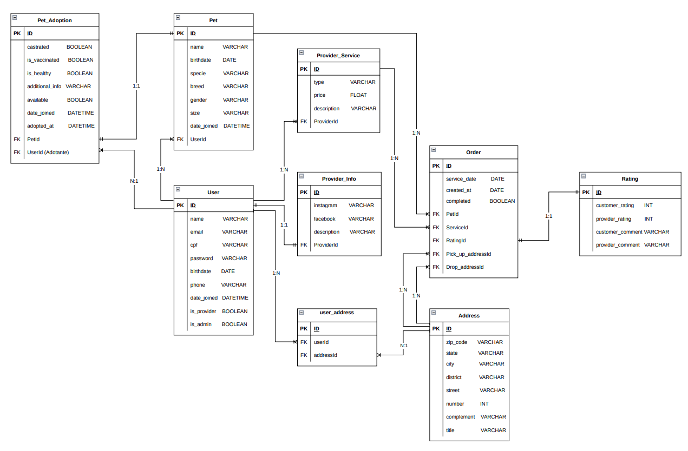

# Aplicação Pet Way

  

Este projeto foi desenvolvido como atividade final (Capstone) do framework Django do curso de Desenvolvimento Web FullStack da Kenzie Academy Brasil.

A plataforma Pet Way tem como objetivo unir os donos de pets com prestadores de serviço.

De um lado temos os donos que não podem ou não tem tempo para passear com seus pets, ou irão viajar mas querem alguém que fique de olho neles. Temos situações que o pet é desobediente ou queira aprender algum truque. Também temos casos em que é preciso levar ou buscar o pet para algum lugar.

Por outro lado temos os prestadores de serviços que podem atuar como dogwalker, petsitter, adestramento e táxi.

Assim, a plataforma facilita a divulgação dos serviços bem como a procura por profissionais, não se restringindo às redes sociais.

## Funcionalidades

- Cadastro de usuário
- Cadastro de pet
- Inserção de redes sociais do prestador
- Cadastro dos serviços prestados (Pet sitter, Pet walker, Pet trainer e Pet taxi)
- Criação da ordem de serviço pelo dono do pet
- Avaliação do serviço, pelo dono do pet e pelo prestador
- Cadastro de animais para adoção

## Documentação da API

[Documentação](https://petway-django.herokuapp.com/) da API para maiores infomações.

[Deploy](https://petway-django.herokuapp.com/) da aplicação.

## Diagrama ER

## Autores

- [João Pedro da Silva Santos](https://www.linkedin.com/in/jo%C3%A3o-pedro-dev/)
- [Jorge Willian Paez Nagakura](https://www.linkedin.com/in/jorgenagakura/)
- [Marcos Kenji Kuribayashi](https://www.linkedin.com/in/marcos-kuribayashi/)
- [Mein Mieko Chang](https://www.linkedin.com/in/meinmiekochang/)
- [Miqueias Carvalho dos Santos](https://www.linkedin.com/in/miqueias-carvalho-dos-santos/)
